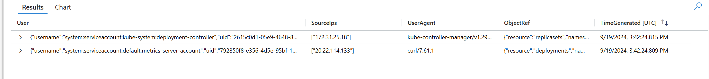

# Persistence: Scenario 2 Defense

## Backstory

### Name: __Blue__

* Still overworked
* Still can only do the bare minimum
* Uses the defaults when configuring systems
* Usually gets blamed for stability or security issues

### Motivations

* A week after the first incident, __Blue__ gets paged at 3am because “the website is slow again”.
* __Blue__, puzzled, takes another look.
* __Blue__ decides to dust off the résumé “just in case”.

## Defense

__Blue__ is paged again with the same message as last time. What is going on? Could this be the same problem again?

### Identifying the Issue

Let's run some basic checks again to see if we can find random workloads:

```console
kubectl get pods --all-namespaces
```

It's back! But how? Let's check the audit logs again:

```kql
AKSAuditAdmin
| where RequestUri startswith "/apis/apps/v1/namespaces/default/deployments" 
    and Verb == "create" 
    and ObjectRef contains "bitcoinero"
| project User, SourceIps, UserAgent, ObjectRef, TimeGenerated
```


How did a service account associated with the metrics-server create a deployment? And what is that sourceIP, it looks familiar...
```console
#Fetch the public IP address for the cluster API server
az network public-ip show --ids $(az aks show --resource-group $RESOURCE_GROUP --name $AKS_NAME --query "networkProfile.loadBalancerProfile.effectiveOutboundIPs[0].id" --output tsv) --query "ipAddress" --output tsv
```

So let me get this straight... the `bitcoinero deployment` was created by another deployment's service account, using curl, from *inside* the cluster? 

__Blue__ is starting to suspect that there may be an unwanted visitor in the cluster. But how to find them? Let's by looking for `ClusterRoles` with high levels of permissions:
```console
#List all ClusterRoles with unlimited access to all APIs and resource types
kubectl get clusterrole -o json | jq '.items[] | select(.rules[]?.resources == ["*"] and .rules[]?.verbs == ["*"
] and .rules[]?.verbs == ["*"]) | .metadata.name'
```

`cluster-admin` is the only role that *should* be in that list. What is this `privileged-role` that we are also seeing?
```console
kubectl get clusterrolebinding -o json | jq '.items[] | select(.roleRef.name == "privileged-role")'
```

Why would the `metrics-server` need such high level privileges? Let's take a closer look at that deployment:
```console
# Look at the details of the deployment
kubectl get deployment -n default metrics-server-deployment -o yaml
# And the associated service
kubectl get svc -n default metrics-server-service -o yaml
```

`metrics-server` is actually running an SSH server! And it's running as a privileged container! This is bad. We need to clean this up fast!
```console
# Service
kubectl delete service -n default metrics-server-service
# Deployment
kubectl delete deployment -n default metrics-server-deployment
# ClusterRoleBinding
kubectl delete clusterrolebinding -n default privileged-binding
# ClusterRole
kubectl delete clusterrole -n default privileged-role
# ServiceAccount
kubectl delete serviecaccount -n default metrics-server-account
```

Ok, the fire is out (for now). But clearly we need more security to keep the bad guys out. How can we restrict access to ensure that only trusted users can create resources?

Let's enable [Entra ID integration](https://learn.microsoft.com/en-us/azure/aks/enable-authentication-microsoft-entra-id) on the cluster and disable local administrative accounts. This way only users who are authenticated by our Entra tenant will have access to the cluster and we can control what those user can do by managing group membership in Entra.

First we will want to creat a group in Entra that contains all of the cluster admins (and make sure our account is in it so we don't get lockd out):
```console
$ADMIN_GROUP=az ad group create --display-name "AKSAdmins" --mail-nickname "AKSAdmins" --query objectId -o tsv
az ad group member add --group "AKSAdmins" --member-id $(az ad signed-in-user show --query id -o tsv)
```

Now let's enable Entra and disable local accounts. This will invalidate the existing leaked admin credentials and require us to authenticate against EntraID for all future cluster administration:
```console
az aks update --resource-group $RESOURCE_GROUP --name $AKS_NAME \ 
  --enable-aad \
  --aad-admin-group-object-ids $ADMIN_GROUP \
  --disable-local-accounts

```

---
ISSUE: THIS IS THE OLD CONTENT. It's got more details, but not sure of equivalent CLI/portal steps

In a new <a href="https://console.cloud.google.com/logs/viewer" target="_blank">StackDriver window</a>, let's run the query:

```console
resource.type="k8s_container"
resource.labels.container_name:"falco"
jsonPayload.rule="Launch Privileged Container" OR jsonPayload.rule="Terminal shell in container"
```

We're looking for `container` logs from `falco` where triggered rules are privileged containers or interactive shells.


In a new <a href="https://console.cloud.google.com/logs/viewer" target="_blank">StackDriver window</a>, let's run this query:

```console
resource.type=k8s_cluster
protoPayload.request.spec.containers.image="alpine"
```

So, we see a few things:

1. A create event that was authorized with the `system:serviceaccount:dev:default` serviceaccount in the `dev` namespace.
1. A pod named `r00t` got created
1. The pod command is `nsenter --mount=/proc/1/ns/mnt -- /bin/bash`
1. The `securityContext` is `privileged: true`
1. The `hostPID` is set to `true`

This is not looking good. Can we see what this container did?

In a new <a href="https://console.cloud.google.com/logs/viewer" target="_blank">StackDriver window</a>, let's search for this `r00t` container logs:

```console
resource.type="k8s_container"
resource.labels.pod_name:r00t
```

Wow. We can see someone was running commands from this container.

But wait, they can run docker commands? How can they talk to the docker on the host from the container? OH NO! They must have broken out of the container and by this point they're on the host!

That `bitcoinero` container again must be what's causing slowness. But, they're trying to do something else.

They tried to create a pod, but failed. So, they created a Service and an Endpoint. They must be trying to open a backdoor of some sort to get back in later.

In cloud shell, let's check if those exist:

```console
kubectl -n kube-system get svc,ep
```

That's one sneaky hacker, for sure. But, jokes on them, We're not using service mesh.

Let's delete that service (the endpoint will be deleted too):

```console
kubectl -n kube-system delete svc/istio-mgmt
```

But, I want to know how did they get in in the first place?!?!?! The `create` event authorized because of the `dev:default` serviceaccount. So, what is in `dev` namespace that led to someone taking over the entire host?

```console
kubectl -n dev get pods
```

There is an `app`, a `db`, and a `dashboard`. Wait a second! Could it be an exposed dashboard?

```console
kubectl -n dev logs $(kubectl -n dev get pods -o name | grep dashboard) -c dashboard
```

```console
kubectl -n dev logs $(kubectl -n dev get pods -o name | grep dashboard) -c authproxy
```

It is an exposed dashboard. That's how they got in. There is `GET /webshell` in authproxy logs with the source IP.

We might want to revoke that serviceaccount token: 

```console
kubectl -n dev delete $(kubectl -n dev get secret -o name| grep default)
```

And perhaps disable the automatic mounting of serviceaccount tokens by setting `automountServiceAccountToken: false` in the pod spec, if the dashboard doesn't need it. 

But, how can we mitigate this further?

The attacker ran a privileged container, which they shouldn't have been able to. So, we should block that. I remember a talk at KubeCon this week about <a href="https://github.com/open-policy-agent/gatekeeper" target="_blank">Open-Policy-Agent/Gatekeeper</a> that gets deployed as an admission controller.

That should work because an admission controller is a piece of code that intercepts requests to the Kubernetes API server after the request is authenticated and authorized.


So, we should set two policies:

1. Deny privileged containers.
1. Allow only the images we expect to have in `dev` and `prd` namespaces.

First, let's apply Gatekeeper itself:

```console
--enable-addons
az aks enable-addons --addons azure-policy --name $AKS_NAME --resource-group $RESOURCE_GROUP

# OLD COMMAND
# kubectl apply -f https://raw.githubusercontent.com/lastcoolnameleft/aks-ctf/main/workshop/scenario_2/security2.yaml
```

Second, let's apply the policies. If you receive an error about `no matches for kind... in version ...`, this means Gatekeeper has not kicked into gear yet. Wait a few seconds then re-apply policies:

```console
# ISSUE: Must use Portal.  See: https://learn.microsoft.com/en-us/azure/governance/policy/concepts/policy-for-kubernetes#assign-a-policy-definition
# ISSUE: Policies take take 20m to sync!
# https://learn.microsoft.com/en-us/azure/aks/use-azure-policy#validate-an-azure-policy-is-running

# OLD COMMAND
kubectl apply -f https://raw.githubusercontent.com/lastcoolnameleft/aks-ctf/main/workshop/scenario_2/security2-policies.yaml
```

Let's see if this actually works by trying to run some containers that violate these policies.

First, let's try to run privileged container:

```console
kubectl apply -f - <<EOF
apiVersion: v1
kind: Pod
metadata:
  name: nginx
  labels:
    app: nginx
spec:
  containers:
  - name: nginx
    image: nginx
    ports:
    - containerPort: 80
    securityContext:
      privileged: true
EOF
```

We see that Kubernetes denied this request for 2 reasons (not whitelisted image and privileged), as expected.

Let's try running a non-whitelisted image:

```console
kubectl -n dev run alpine --image=alpine --restart=Never
```

We see that Kubernetes rejected this request again due to image not being whitelisted/allowed, as expected.

Can we still run pods that meet/satisfy the Gatekeeper policies? Let's find out:

```console
kubectl -n dev run ubuntu --image=ubuntu --restart=Never
```

Yes, looks like we can run pods that satisfy the policies and requirements we set on our cluster.

Even though we applied Falco and Gatekeeper, we should not continue to use this cluster since it has been compromised. We should create a new cluster and re-deploy our applications there once we've hardened and secured it enough.
